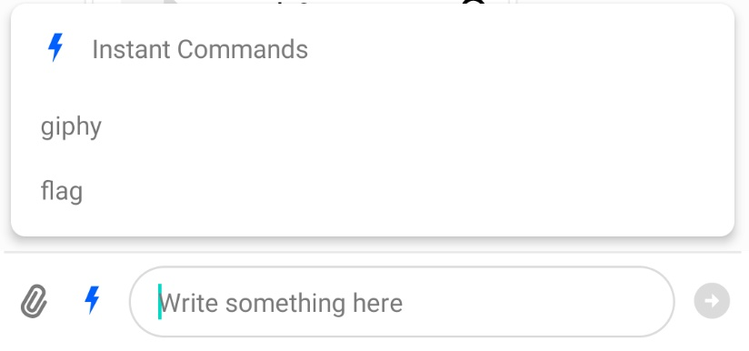

# Message Input

`MessageInputView` is the view used to create a new chat message and send it to a channel.

|Light|Dark| 
|---|---|
|||

It supports the following features:

* Emoticons
* Attachments
* Slash Commands
* Typing events
* Editing messages
* Threads
* Mentions
* Replies

## Usage

To use `MessageInputView`, include it in your XML layout. It usually goes below a `MessageListView`.

```xml
<io.getstream.chat.android.ui.message.input.MessageInputView
        android:id="@+id/messageInputView"
        android:layout_width="0dp"
        android:layout_height="wrap_content"
        app:layout_constraintBottom_toBottomOf="parent"
        app:layout_constraintEnd_toEndOf="parent"
        app:layout_constraintStart_toStartOf="parent"
        app:layout_constraintTop_toBottomOf="@+id/messageListView"
        />
```

The recommended way of setting up the input view is by binding it to a `MessageInputViewModel`. This will make it fully functional by setting up any necessary listeners and data handling.

```kotlin
// Instantiate the ViewModel for a given channel
val factory: MessageListViewModelFactory = MessageListViewModelFactory(cid = "channelType:channelId")
val viewModel: MessageInputViewModel by viewModels { factory }
// Bind it with MessageInputView
viewModel.bindView(messageInputView, viewLifecycleOwner)
```

## Handling Actions 

Actions can be handled by setting listeners on this view. For example, you can handle clicks of the send button or when the user starts and stops typing:

```kotlin
messageInputView.setOnSendButtonClickListener {
    // Handle send button click
}

messageInputView.setTypingListener(
    object : MessageInputView.TypingListener {
        override fun onKeystroke() {
            // Handle keystroke case
        }

        override fun onStopTyping() {
            // Handle stop typing case
        }
    }
)
```

You can show a custom error when the maximum message length is exceeded:

```kotlin
messageInputView.setMaxMessageLengthHandler { messageText, messageLength, maxMessageLength, maxMessageLengthExceeded ->
    if (maxMessageLengthExceeded)  {
        // Show custom max-length error
    } else {
        // Hide custom max-length error
    }
}
```

It is also possible to change the handler that sends messages. By default, this is set up by `bindView` and calls into the ViewModel to perform these actions.  

```kotlin
messageInputView.setSendMessageHandler(
    object : MessageInputView.MessageSendHandler {
        override fun sendMessage(messageText: String, messageReplyTo: Message?) {
            // Handle send message
        }

        override fun sendMessageWithAttachments(
            message: String,
            attachmentsWithMimeTypes: List<Pair<File, String?>>,
            messageReplyTo: Message?,
        ) {
            // Handle message with attachments
        }

        override fun sendToThreadWithAttachments(
            parentMessage: Message,
            message: String,
            alsoSendToChannel: Boolean,
            attachmentsWithMimeTypes: List<Pair<File, String?>>,
        ) {
           // Handle message to thread with attachments
        }

        override fun sendToThread(parentMessage: Message, messageText: String, alsoSendToChannel: Boolean) {
            // Handle message to thread
        }

        override fun editMessage(oldMessage: Message, newMessageText: String) {
            // Handle edit message
        }

        override fun dismissReply() {
            // Handle dismiss reply
        }
    }
)
```

## Customization

`MessageInputView` can be customized in two ways: using XML attributes and programmatically using style transformations.

### Using XML Attributes

Many attributes of this View can be configured, like changing its color, the border and the color of the message input, fonts, components visibility, and so on. The full list of available attributes can be found [here](https://github.com/GetStream/stream-chat-android/blob/main/stream-chat-android-ui-components/src/main/res/values/attrs_message_input_view.xml).

Here's an example of setting some custom attributes:

```xml
<io.getstream.chat.android.ui.message.input.MessageInputView
    android:id="@+id/messageInputView"
    android:layout_width="0dp"
    android:layout_height="wrap_content"
    android:background="@color/grey_light"
    app:streamUiMessageInputEditTextBackgroundDrawable="@drawable/stream_ui_shape_edit_text_squared"
    app:streamUiMessageInputTextStyle="italic"
    app:streamUiMessageInputDividerBackgroundDrawable="@drawable/stream_ui_divider_green"
    app:streamUiMessageInputTextColor="@color/stream_ui_white"
    />
```

This will create this version of `MessageInputView`:


Here's another example with different attributes set:

```xml
<io.getstream.chat.android.ui.message.input.MessageInputView
    android:id="@+id/messageInputView"
    android:layout_width="0dp"
    android:layout_height="wrap_content"
    app:layout_constraintBottom_toBottomOf="parent"
    app:layout_constraintEnd_toEndOf="parent"
    app:layout_constraintStart_toStartOf="parent"
    app:layout_constraintTop_toBottomOf="@+id/messageListView"
    app:streamUiMessageInputEditTextBackgroundDrawable="@drawable/stream_ui_shape_edit_text_rounded"
    app:streamUiMessageInputTextStyle="italic"
    android:background="@color/stream_ui_black"
    app:streamUiMessageInputDividerBackgroundDrawable="@drawable/stream_ui_divider_green"
    app:streamUiMessageInputTextColor="@color/stream_ui_white"
    />
```

This produces the following styling:


Different configurations can be used to achieve the desired appearance of `MessageListView`. If you don't need to change this View appearance at runtime, XML should be enough. But if you need to able to customize it at runtime, then you can use `MessageInputViewStyle` as described in the next section.

### Using Style Transformations

You can use [TransformStyle](https://github.com/GetStream/stream-chat-android/blob/develop/stream-chat-android-ui-components/src/main/kotlin/io/getstream/chat/android/ui/TransformStyle.kt) to apply global style transformations to all `MessageInputView` instances. For example, you can create set up a `messageInputStyleTransformer` like this one to change the input text color:

```kotlin
TransformStyle.messageInputStyleTransformer = StyleTransformer { viewStyle ->
    viewStyle.copy(
        messageInputTextColor = ContextCompat.getColor(requireContext(), R.color.stream_ui_white)
    )
}
```

:::note
The transformer should be set before the View is rendered to make sure that the new style was applied.
:::

## Creating Custom Suggestion Items

The suggestion list popup is used to provide autocomplete suggestions for commands and mentions. To customize the appearance of suggestion list items you need to provide your own `SuggestionListViewHolderFactory`. Here's an example of a custom command item that displays just a command name:

1. Create the `item_command.xml` layout:

```xml
<?xml version="1.0" encoding="utf-8"?>
<FrameLayout xmlns:android="http://schemas.android.com/apk/res/android"
    android:layout_width="match_parent"
    android:layout_height="wrap_content"
    android:background="?attr/selectableItemBackground"
    android:paddingStart="16dp"
    android:paddingEnd="16dp"
    android:paddingTop="8dp"
    android:paddingBottom="8dp">

    <TextView
        android:id="@+id/commandNameTextView"
        android:layout_width="wrap_content"
        android:layout_height="wrap_content" />

</FrameLayout>
```

2. Create a custom ViewHolder that extends `BaseSuggestionItemViewHolder`, and a custom ViewHolder factory which extends `SuggestionListItemViewHolderFactory`:

```kotlin
class CustomSuggestionListViewHolderFactory : SuggestionListItemViewHolderFactory() {
    override fun createCommandViewHolder(
        parent: ViewGroup,
    ): BaseSuggestionItemViewHolder<SuggestionListItem.CommandItem> {
        return ItemCommandBinding
            .inflate(LayoutInflater.from(parent.context), parent, false)
            .let(::CustomCommandViewHolder)
    }
}

class CustomCommandViewHolder(
    private val binding: ItemCommandBinding,
) : BaseSuggestionItemViewHolder<SuggestionListItem.CommandItem>(binding.root) {

    override fun bindItem(item: SuggestionListItem.CommandItem) {
        binding.commandNameTextView.text = item.command.name
    }
}
```

4. Set the custom ViewHolder factory on `MessageInputView`:

```kotlin
messageInputView.setSuggestionListViewHolderFactory(CustomSuggestionListViewHolderFactory())
```

This produces the following result:




## Attachment Size Limits

There is a limit for the size of attachments in this View. The default value is 20MB, and selecting a file larger than that limit will notify the user:


You can use `MessageInputViewStyle.attachmentMaxFileSize` to change the maximum allowed size of attachments. However, there's a 20MB limit in Stream Chat's CDN as well. To send larger attachments, you can [use your own CDN](https://getstream.io/chat/docs/android/file_uploads/?language=kotlin#using-your-own-cdn).

You can listen for large attachments being added to the list of attachments (for example, to present a custom message to the user in this case) with `MessageInputView.listenForBigAttachments`. 
